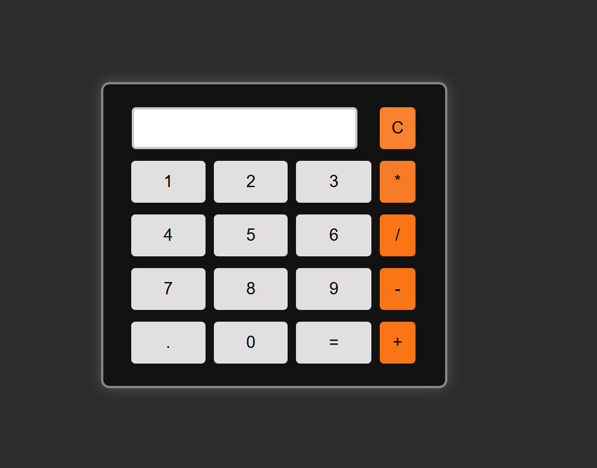

# 🧮 Simple Calculator

A responsive and interactive calculator made using **HTML**, **CSS**, and **JavaScript**. It performs basic arithmetic operations like addition, subtraction, multiplication, and division.

---

## 📸 Screenshot

 

## 🚀 Live Demo

👉https://sumitjangid2446.github.io/Calculater/

## 🛠 Tech Stack

- 🔹 HTML5  
- 🔹 CSS3  
- 🔹 JavaScript (Vanilla)

---

## 🎯 Features

- ✅ Simple and clean UI  
- ✅ Responsive design (works on mobile too)  
- ✅ Basic operations: `+`, `-`, `×`, `÷`  
- ✅ Clear and backspace functions

---

## ⚙️ How to Use

1. Clone the repository  
`

💻 GitHub: [@sumitjangid2446](https://github.com/sumitjangid2446)

git clone https://github.com/sumitjangid2446/Calculater.git
## 🙋‍♂️ Author

Made with  **Sumit Jangid **

- 📧 Email: sumitjangid2446@gmail.com
